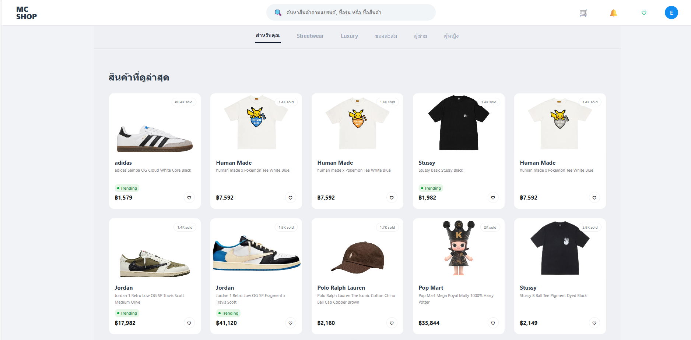
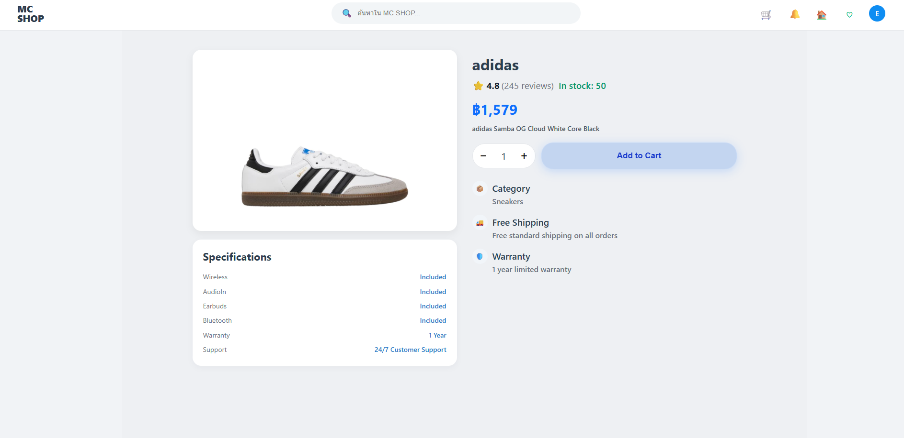

#  MC SHOP – E-Commerce Web Application

MC SHOP คือเว็บแอปพลิเคชัน E-Commerce ที่พัฒนาด้วย **Vue 3 + TypeScript**
รองรับระบบตะกร้าสินค้า, Checkout, การชำระเงิน (PromptPay), และการจัดการคำสั่งซื้อ

---

## Features
- Login / Register
- Cart Management (เพิ่ม / ลบ / แก้จำนวน)
- Checkout System
- Address Management
- Payment Method
  - Credit Card / Debit Card
  - PayPal
  - PromptPay (QR Payment)
  - Mobile Banking
  - Cash on Delivery
- Order Confirmation
- Order History (My Orders)
- ใช้ LocalStorage จำลอง Backend

---

## Tech Stack
- **Frontend**: Vue 3 (Composition API)
- **Language**: TypeScript
- **Router**: Vue Router
- **State**: LocalStorage
- **Styling**: CSS (Custom UI / Glassmorphism)
- **Build Tool**: Vite

---


## Checkout Flow
1. เพิ่มสินค้าเข้าตะกร้า
2. เลือกที่อยู่จัดส่ง
3. เลือกวิธีชำระเงิน
4. หากเลือก PromptPay → แสดง QR Code
5. ยืนยันการชำระเงิน
6. บันทึกคำสั่งซื้อ → แสดงใน My Orders


##  Visual Journey (User Experience)

โปรเจกต์นี้ถูกออกแบบโดยเน้น **ประสบการณ์ผู้ใช้ (UX)** ที่ลื่นไหล ใช้งานง่าย และมีความต่อเนื่องตั้งแต่การเลือกสินค้าไปจนถึงหลังการสั่งซื้อ โดยแบ่งออกเป็น **4 ระยะหลัก (User Journey)** ดังนี้

---

###  Shopping Phase (Product Discovery)

ระยะเริ่มต้นของผู้ใช้ในการค้นหาและเลือกชมสินค้า โดยออกแบบให้ข้อมูลสำคัญเข้าถึงง่ายและลดความซับซ้อนในการตัดสินใจ

**UX / Technical Highlights**
- ใช้ Grid System และ Glassmorphism UI เพื่อความทันสมัย
- จัด Visual Hierarchy ให้ชื่อสินค้า ราคา และปุ่มสั่งซื้อโดดเด่น
- รองรับการกรองสินค้าเพื่อช่วยให้ผู้ใช้ค้นหาได้เร็วขึ้น





---

###  Decision Phase (Cart Management)

ผู้ใช้สามารถตรวจสอบและจัดการสินค้าก่อนชำระเงิน พร้อมแสดงผลยอดรวมแบบ Real-time

**Technical Highlights**
- ใช้ Vue Reactive State คำนวณยอดรวมและภาษีอัตโนมัติ
- เก็บข้อมูลตะกร้าสินค้าไว้ใน LocalStorage

<p align="center">
  
</p>

---

###  Payment Phase (Checkout & QR Payment)

ระยะการชำระเงินที่ออกแบบให้กระชับ ชัดเจน และลดภาระของผู้ใช้

**UX Highlights**
- Checkout แบบ **Step-by-Step**
- ลด Cognitive Load ในการกรอกข้อมูล

**Technical Insight**
- แสดงยอดชำระผ่าน Modal
- จำลองการยืนยันการโอนเงินด้วย PromptPay QR

<p align="center">
  
  
</p>

---

###  Post-Purchase (Order Management)

ระยะหลังการสั่งซื้อ สำหรับการยืนยันคำสั่งซื้อและตรวจสอบประวัติย้อนหลัง

**Technical Insight**
- เก็บข้อมูลคำสั่งซื้อในรูปแบบ **Array of Objects**
- จัดเก็บใน **LocalStorage** เพื่อเรียกดูย้อนหลังได้

<p align="center">
  
  
</p>

---


---

## Demo
Demo version (Local only)


## Author
- Name: **[Nattawut]**
- GitHub: https://github.com/your-username


---

### Project Structure 

```md
## Project Structure

src/
├─ assets/           # Images, icons
├─ components/       # Reusable components
├─ views/            # Pages (Home, Cart, Checkout, Orders)
├─ router/           # Vue Router config
├─ styles/           # Global styles
└─ main.ts


```


## Installation
```bash
git clone https://github.com/your-username/mc-shop.git
cd mc-shop
npm install
npm run dev
```

---

## Data Flow (LocalStorage)

- cart → เก็บสินค้าในตะกร้า
- addresses → ที่อยู่จัดส่ง
- orders → ประวัติคำสั่งซื้อ
- lastOrderId → คำสั่งซื้อล่าสุด
- lastGrandTotal → ยอดรวมล่าสุด


## Payment Logic

- PromptPay
  - สร้างคำสั่งซื้อสถานะ `WaitingPayment`
  - แสดง QR Code
  - กดยืนยัน → เปลี่ยนเป็น `Paid`


---

##  Technical Features

- **Type-Safe Development**: ใช้ TypeScript กำหนด Schema สำหรับ Product, Cart Item และ User Data เพื่อความแม่นยำของข้อมูล
- **State Persistence**: ระบบจัดการตะกร้าสินค้าที่คงอยู่แม้ Refresh หน้าเว็บ (LocalStorage Persistence)
- **Responsive Design**: รองรับการใช้งานทุกหน้าจอ (Desktop, Tablet, Mobile) ด้วย Flexbox และ CSS Grid
- **Glassmorphism UI**: ดีไซน์หน้าเว็บที่เน้นความโปร่งแสงและทันสมัย โดยใช้ Custom CSS

## Tech Stack Details

| Technology | Usage |
|------------|-------|
| **Vue 3** | Framework หลัก (Composition API) |
| **TypeScript** | พัฒนาด้วยระบบ Type-checking |
| **Vue Router** | จัดการ Client-side Routing |
| **Vite** | Build tool ความเร็วสูง |
| **CSS3** | Custom Styles (Glassmorphism focus) |
